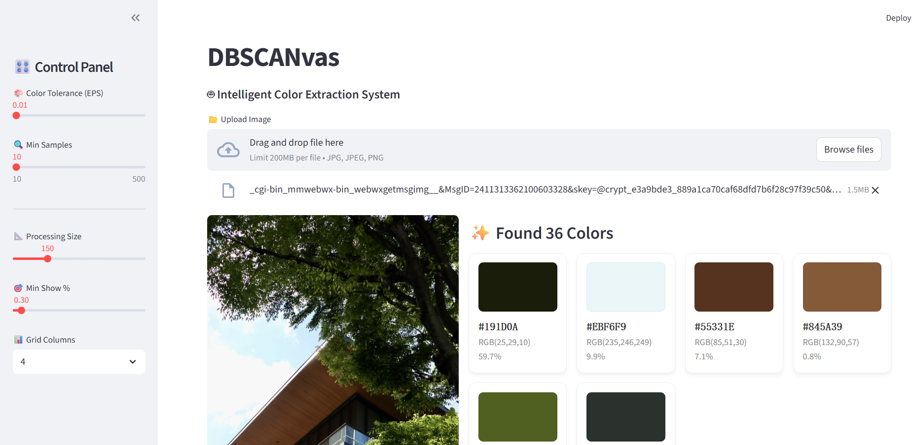

# DBSCANvas 🎨

## Quick Access https://dbscanvas.streamlit.app/

**DBSCAN密度クラスタリングアルゴリズムに基づくインテリジェントな画像テーマカラー抽出ツール。**

従来のK-Meansアルゴリズム（色数を事前に指定する必要がある）とは異なり、DBSCANvasは色の密度分布に基づいて、画像内の真の主色を自動的に発見し、ノイズを効果的に除去します。



### 🛠 原理解説 (How it works)

このプロジェクトの核心は、**画像処理**を**データクラスタリング**問題に変換することです：

1.  **ピクセルを座標として扱う**：画像内の各ピクセルを3D色空間 `(Red, Green, Blue)` の座標点にマッピングします。
2.  **高密度領域の探索**：
    * 色が近いピクセルは空間内で距離が近く、高密度領域を形成します。
    * **DBSCAN (Density-Based Spatial Clustering of Applications with Noise)** アルゴリズムは、これらの高密度クラスタ領域（コアポイント）を自動的に見つけます。
3.  **抽出とノイズ除去**：
    * クラスタ内のピクセルの平均値を計算し、**テーマカラー**を取得します。
    * まばらで孤立した色の点は自動的に**ノイズ**としてマークされ、フィルタリングされるため、抽出結果の純度が保証されます。

### ✨ 特徴

* **K値の指定不要**：アルゴリズムが密度に基づいて自動的に抽出する色数を決定します。
* **ノイズ耐性が高い**：画像内の微細な雑色やノイズを自動的に無視します。
* **インタラクティブなパラメータ調整**：Streamlitインターフェースを通じて `eps`（色許容度）と `min_samples`（最小面積）をリアルタイムで調整でき、即座に結果を確認できます。

### 🚀 クイックスタート

#### 1. 依存関係のインストール
```bash
pip install streamlit scikit-learn numpy Pillow
```

#### 2. アプリケーションの起動
```bash
streamlit run DBSCANvas.py
```

#### 3. 使用方法
1. ブラウザでアプリケーションが開いたら、画像をアップロードします。
2. サイドバーでパラメータを調整します：
   - **Color Tolerance (EPS)**: 色の許容範囲（小さいほど精密、大きいほど概括的）
   - **Min Samples**: 最小サンプル数（ノイズとして扱うピクセル数の閾値）
   - **Processing Size**: 処理サイズ（大きいほど正確だが遅い）
   - **Min Show %**: 表示する最小色の割合
3. 結果がリアルタイムで更新されます。

### 📝 技術スタック

* **Streamlit**: Webインターフェース
* **scikit-learn**: DBSCANクラスタリングアルゴリズム
* **NumPy**: 数値計算
* **Pillow (PIL)**: 画像処理

### 🎯 応用例

* デザイン作業でのカラーパレット抽出
* 写真分析と色調分析
* ブランドカラーの識別
* 画像の視覚的特徴の研究
